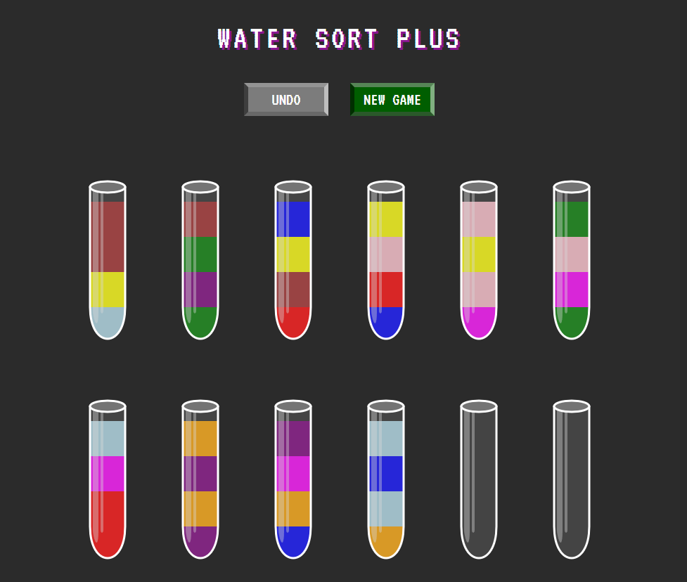

# Bottle Fill Game

A simple game project built with Vite.

## Overview

The Bottle Fill Game challenges players to fill bottles according to specific requirements. Built with Vite for fast development and optimized performance.

## Getting Started

Follow these instructions to get a copy of the project up and running on your local machine.

### Prerequisites

- [Node.js](https://nodejs.org/) (includes npm)
- [Vite](https://vitejs.dev/) - if not globally installed, it will be set up as a local dependency

### Installation

git clone https://github.com/yourusername/Bottle-fill-game.git
cd Bottle-fill-game/src
npm install
npm run dev

This will launch the Vite development server, and you should see the game running at the provided local URL (typically http://localhost:3000).
